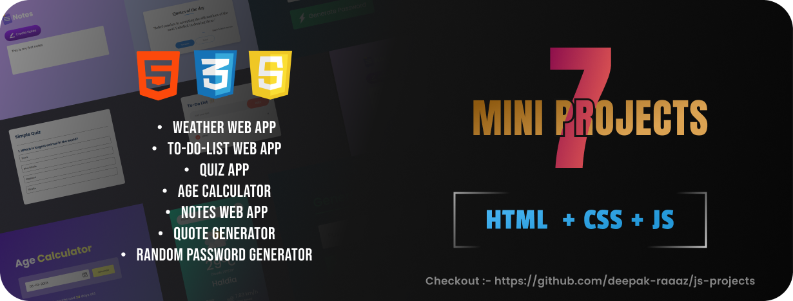

<!-- [![LinkedIn][linkedin-shield]][linkedin-url] -->

<!-- PROJECT LOGO -->
 

  

  <h3 align="center">7 Mini Projects - [ HTML + CSS + JS ]</h3>

  <!-- 

    A clone of the Spotify web application built using ReactJS and the Spotify API.
  
 -->
   

<!-- TABLE OF CONTENTS -->

<!-- ABOUT THE PROJECT -->

## About The Project

<!-- [![Product Name Screen Shot][product-screenshot]](https://example.com) -->

This repository contains a collection of seven mini projects developed using HTML, CSS, and JavaScript. Each project serves as a standalone application with its own unique functionality. Below is a brief overview of each project along with instructions on how to run them.

## List of Projects

<ol>
    <li>
      <a href="#about-the-project">Weather Web App</a>
    </li>
    <li>
      <a href="#getting-started">To-Do List Web App</a>
    </li>
    <li><a href="#usage">Quiz App</a></li>
    <li><a href="#contributing">Age Calculator</a></li>
    <li><a href="#license">Notes Web App</a></li>
    <li><a href="#contact">Quote Generator</a></li>
    <li><a href="#contact">Random Password Generator</a></li>
  </ol>

## Built With

- [![HTML5][HTML5]][HTML5-url]
- [![CSS3][CSS3]][CSS3-url]
- [![JavaScript][JavaScript]][JavaScript-url]
- [![Git][Git]][Git-url]

<!-- 
(<a href="#readme-top">back to top</a>)
 -->

<!-- GETTING STARTED -->

## Projects
### 1.Weather Web App
   A web application that fetches weather information for a specific location using an API.
   - Features:
     - Display current weather conditions including temperature, humidity, and wind speed.
     - Option to search for weather information by city name.
   - Technologies Used: HTML, CSS, JavaScript, Weather API.

### 2.To-Do List Web App
   A simple to-do list application for managing tasks.
   - Features:
     - Add, edit, and delete tasks.
     - Mark tasks as completed.
     - Local storage to persist tasks.
   - Technologies Used: HTML, CSS, JavaScript.

### 3.Quiz App
   A quiz application with multiple-choice questions.
   - Features:
     - Randomly generated questions from a predefined set.
     - Score tracking and display.
     - Option to retake the quiz.
   - Technologies Used: HTML, CSS, JavaScript.

### 4.Age Calculator
   A tool to calculate age based on the date of birth.
   - Features:
     - Input field to enter the date of birth.
     - Calculation of age based on the current date.
   - Technologies Used: HTML, CSS, JavaScript.

### 5.Notes Web App
   An application for taking and managing notes.
   - Features:
     - Add, edit, and delete notes.
     - Save notes locally.
     - Simple and intuitive user interface.
   - Technologies Used: HTML, CSS, JavaScript.

### 6.Quote Generator
A web application that generates random quotes.
   - Features:
     - Fetches quotes from an API.
     - Option to generate a new quote.
     - Share quote on social media.
   - Technologies Used: HTML, CSS, JavaScript, Quote API.

### 7.Random Password Generator
   A tool to generate random passwords.
   - Technologies Used: HTML, CSS, JavaScript.

## How to Run:

1. Clone this repository to your local machine.
2. Navigate to the directory of the project you want to run.
3. Open the `index.html` file in your preferred web browser.

## Contributing

Contributions are welcome! If you find any bugs or have suggestions for improvements, please feel free to open an issue or submit a pull request.

You can also simply open an issue with the tag "enhancement".
Don't forget to give the project a star! Thanks again!

1. Fork the Project
2. Create your Feature Branch (`git checkout -b feature/AmazingFeature`)
3. Commit your Changes (`git commit -m 'Add some AmazingFeature'`)
4. Push to the Branch (`git push origin feature/AmazingFeature`)
5. Open a Pull Request

<!-- 
(<a href="#readme-top">back to top</a>)
 -->

<!-- LICENSE -->

## License

Distributed under the MIT License. See `LICENSE.txt` for more information.

<!-- 
(<a href="#readme-top">back to top</a>)
 -->

<!-- CONTACT -->

## Contact

Deepak Kumar - deepakjamui26@gmail.com
[![LinkedIn][linkedin-shield]][linkedin-url]

Project Link: [https://github.com/deepak-raaaz/js-projects](https://github.com/deepak-raaaz/js-projects)

(<a href="#readme-top">back to top</a>)

<!-- MARKDOWN LINKS & IMAGES -->

[linkedin-shield]: https://img.shields.io/badge/-LinkedIn-black.svg?style=for-the-badge&logo=linkedin&colorB=555
[linkedin-url]: https://www.linkedin.com/in/deepak-raaaz/
[HTML5]: https://img.shields.io/badge/html5-%23E34F26.svg?style=for-the-badge&logo=html5&logoColor=white
[HTML5-url]: https://mui.com/
[JavaScript]: https://img.shields.io/badge/javascript-%23323330.svg?style=for-the-badge&logo=javascript&logoColor=%23F7DF1E
[JavaScript-url]: https://developer.mozilla.org/en-US/docs/Web/JavaScript
[Git]: https://img.shields.io/badge/git-%23F05033.svg?style=for-the-badge&logo=git&logoColor=white
[Git-url]: https://git-scm.com/
[CSS3]: https://img.shields.io/badge/css3-%231572B6.svg?style=for-the-badge&logo=css3&logoColor=white
[CSS3-url]: https://developer.mozilla.org/en-US/docs/Web/CSS
